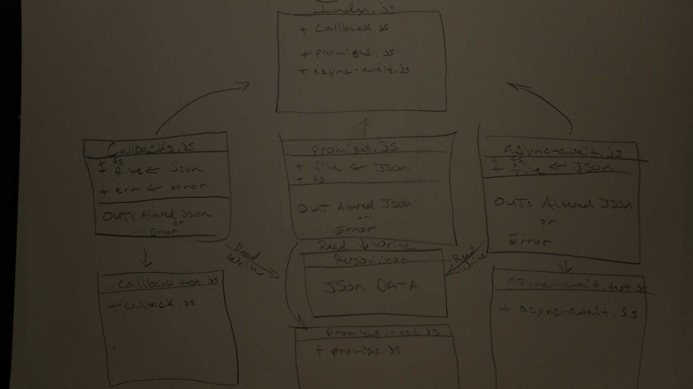

# LAB - 03

## Async

### Author: James Dunn

### Links and Resources
* [submission PR](https://github.com/james-401-advanced-javascript/lab-03/pull/1)
* [travis](https://travis-ci.com/james-401-advanced-javascript/lab-03)
* [front-end](https://jamesdunn-lab-03.herokuapp.com)

#### Documentation
* [jsdoc](https://jamesdunn-lab-03.herokuapp.com/docs)

### Modules
#### `callbacks.js`
#### `promises.js`
#### `async-await.js`

##### Exported Values and Methods
###### `readCallback`
###### `readPromise`
###### `readAsync`

### Setup
#### `.env` requirements
* `PORT` - 3000

#### Running the app
* `npm start`
* Endpoint: `index.js`
  * Reads and writes to and from json file.
  
#### Tests
* How do you run tests?
* `npm test`

#### UML

